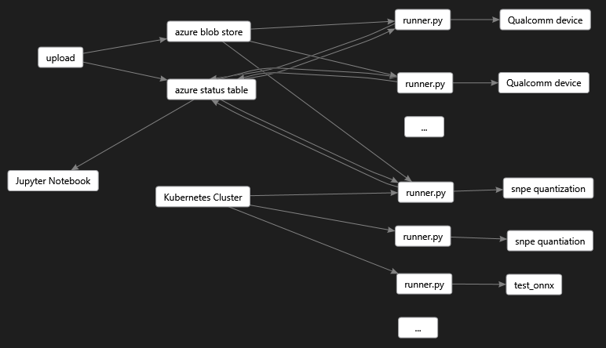
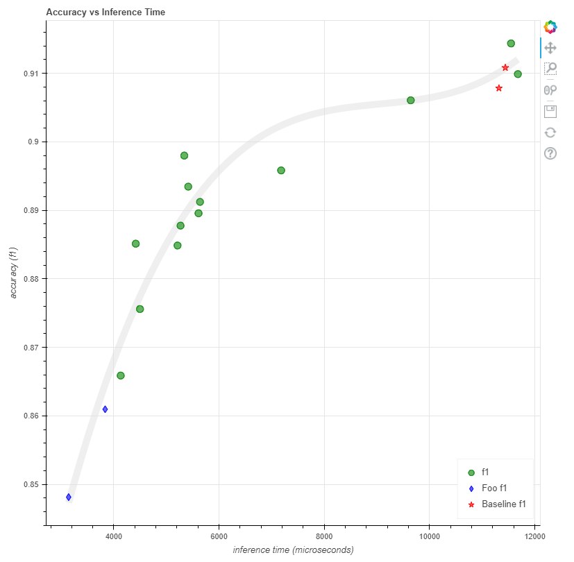

# Readme

This folder contains code that automates the testing of FaceSynthetics models across
one or more machines that are connected to Qualcomm 888 boards.  Many thanks to
Yatao Zhong for the original device code included in this test suite.

The code is organized into:
1. [SNPE Device Code](snpe/readme.md) that knows how to use the Qualcomm SNPE SDK to talk
to the device, convert ONNX models to .dlc, quantize them, and test them on the board
using the Android `adb` tool.

1. [Azure Code](azure/readme.md) that talks to a configured Azure storage account for
uploading models to test, downloading them, uploading test results, and keeping an
Azure table "status" that summarizes results so far.

1. [Notebooks](notebook/gallery_performance.md) contains a Jupyter Notebook that can
visualize the results from the Azure table.

Both are based on Python, so it is best if you setup a new Conda Python environment
for Python 3.7 with the `requirements.txt` included here using:

```shell
pip install -r requirements.txt
```

The SNPE SDK only works on Linux, so you need a Linux machine with this repo. Then follow additional
setup in each of the above readmes.

## Workflow

The overall workflow looks like this. One or more Linux machines are setup as above and are running
`azure/runner.py` including a Kubernetes cluster setup for quantization (see docker folder).



Each instance of `runner.py` looks for work, and executes it in priority order where the
prioritization is defined by the `find_work_prioritized` function in the runner.  This
prioritization maps to the columns of the status table as follows:

1. **macs:** convert to .dlc and post Macs score and `snpe-dlc-viewer` output and do model quantization (runs on Linux) - priority 20
1. **total_inference_avg** run `snpe_bench.py` with quantized model on Qualcomm device DSP - priority 30
1. **f1_onnx** compute f1 from onnxruntime on .onnx model on a 10k test set on Linux - priority 60
1. **f1_1k** compute f1 on quantized .dlc model on Qualcomm device DSP with a 1k test set - priority
is the mean f1 score so that quicker models are prioritized.
1. **f1_1k_f** compute f1 on floating point .dlc model on on Qualcomm device CPU with a 1k test set
   - priority 10 * the mean f1 score so that quicker models are prioritized.
1. **f1_10k** compute f1 on quantized model on a 10k test set - priority = 100 * the mean f1 score
   so that quicker models are prioritized.

Lower number means higher priority job and each machine will run the highest priority work first.

You can override the priority of a specific job by passing a `--proprity` parameter on the
`upload.py` script or by editing the Azure `status` table and adding a `priority` field to the JSON
stored there. You can set any priority number you want, if you specify priority 0 it will run before
anything else which can be handy if you have a cool new model that you want to bump to the top of
the list.

Notice some of the above jobs can run on Linux and do not require Qualcomm device. So in order to
maximize throughput on machines that do have a Qualcomm devices you can allocate other Linux
machines with no Qualcomm devices to do the other work, namely, converting models, quantizing them,
and running the `onnxruntime` test set.

Folks across your team can use the `azure/upload.py` to submit jobs and let them run.  You can use
`status.py` to monitor progress or look at the Azure `status` table.  Various status messages are
posted there so you can see which machine is doing what and is in what stage of the job.

Next you can go to the `notebook` page and get some pretty pictures of your Pareto Curve like this:


